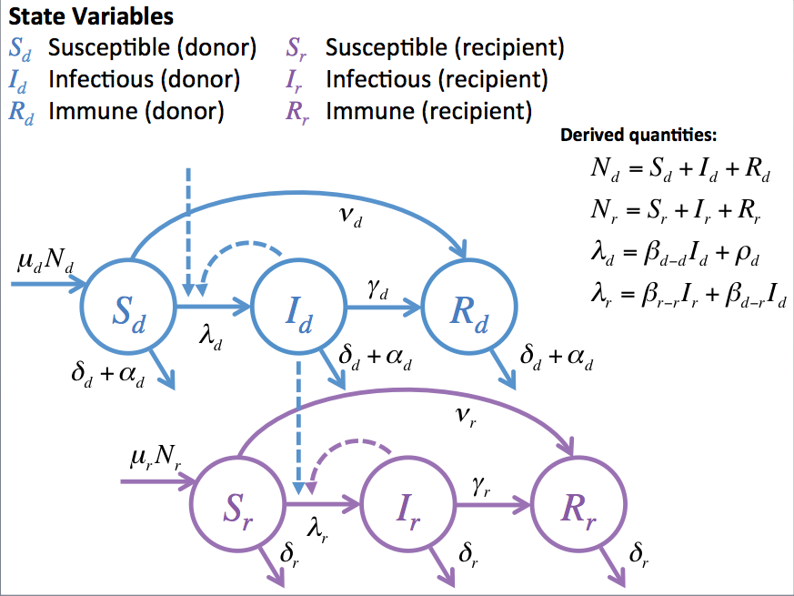

```{r setup, include=FALSE}
knitr::opts_chunk$set(echo = TRUE)
# install these packages from CRAN if you do no have them
library(pomp)
library(readr)
library(tidyverse)
library(gridExtra)
# this package (dviz.supp) is not on CRAN; if you don't have it, you can comment out lines 13 and 35 in plotFunctions.R
library(dviz.supp) # required to call theme_dviz_hgrid()
# load external functions and parameter values
source('helperFunctions.R')
source('plotFunctions.R')
pars <- read_csv('parameters.csv')
# Format Table S1
tab1 <- pars %>% select(Parameter, Description, Name, Units, Example1, Example2) %>% mutate(Example1 = as.character(ifelse(Example1 < 0.01,signif(Example1,2),round(Example1,2))), Example2 = as.character(ifelse(Example2 < 0.01,signif(Example2,2),round(Example2,2)))) %>% mutate(Example1 = ifelse(is.na(Example1),'(derived)',Example1), Example2 = ifelse(is.na(Example2),'(derived)',Example2)) %>% rename(`Example 1` = Example1, `Example 2` = Example2)
# Format Table S2
tab2 <- pars %>% filter(!is.na(Intervention)) %>% select(Intervention, Type, Description)
```

## Modelling methods

We defined a simple 2-host system, i.e., donors and recipients, with three compartmental classes, Susceptible-Infected-Recovered (SIR), for each host species, and spillover from donors to recipients [1]. Model simulations are conducted using an Euler-multinomial approximation to the two-host ordinary differential equation model. Our model builds off previously proposed frameworks (e.g. [2, 3]), but our focus is more on the practical implications of potential interventions. Using a tractable framework, we focus on the comparative outcomes of simulated management options applied to either donor or recipient populations and highlight potential non-linearities in spillover risk that result.

We use the model to simulate disease dynamics for two sets of fixed parameter values (Table 1). We examine how each particular ecological intervention applied to a single parameter (process) affects disease outcomes in recipient populations in terms of: 1) the total number of cases in the recipient population, and 2) the total number of spillover events in a defined timeframe. 

Interventions were implemented as a fixed proportional reduction in a parameter value, except culling and vaccination, which were specified as annual proportions that were then converted to rates. We assumed that each specified intervention affected a single parameter.

```{r initialize, echo=FALSE}
# Define control parameters
SEED <- 20190326
REPS <- 1000
TIMESTEP <- 1
YEARS <- 5
INITTYPE <- 'EE'
SIMID <- 8

# Define model parameters
ex1 <- pars$Example1
names(ex1) <- pars$Name
ex2 <- pars$Example2
names(ex2) <- pars$Name

# Fill in transmission coefficients
ex1['beta_dd'] <- with(as.list(ex1),betaCalc(R0_dd,pop0_d,mort_d,1/dur_d))
ex1['beta_dr'] <- with(as.list(ex1),betaCalc(R0_dr,pop0_r,mort_d,1/dur_d))
ex1['beta_rr'] <- with(as.list(ex1),betaCalc(R0_rr,pop0_r,mort_r,1/dur_r))
ex2['beta_dd'] <- with(as.list(ex2),betaCalc(R0_dd,pop0_d,mort_d,1/dur_d))
ex2['beta_dr'] <- with(as.list(ex2),betaCalc(R0_dr,pop0_r,mort_d,1/dur_d))
ex2['beta_rr'] <- with(as.list(ex2),betaCalc(R0_rr,pop0_r,mort_r,1/dur_r))

propChange <- c(10^(-5:-2),0.5,seq(0.1,1,0.1))
interventions <- tab2$Type

# Initialize
inits1 <- initSim(ex1,INITTYPE)
inits2 <- initSim(ex2,INITTYPE)

fn <- paste0('simDat_',INITTYPE,'.Rdata')
fn2 <- paste0('simDatIntervention_',INITTYPE,'.Rdata')
```

Each simulation was run for `r YEARS` years using daily time steps with initial population sizes of `r as.character(ex1[['pop0_d']])` hosts in each of the donor and recipient populations. We initialized all simulations at the endemic equilibrium (with values rounded) for the donor and at the disease-free equilibrium for the recipeint. We used parameter values representing two different example spillover systems, which differed in their assumed contact rates and durations of infection. We ran `r REPS` replicate simulations per ecological intervention condition. We present the average outcomes (total cases in the recipient population and total number of spillover events) in Figures S3-S6. 

Model specification and assumptions are described below. Note that the modeling framework is intentionally simplistic because our goal is to visualize potential non-linearities in effects of different ecological interventions. This type of framework could be adapted to address ecological complexities of particular systems (e.g., environmental transmission, spatial structure, etc.). Currently, the framework is intended to generate hypotheses for further examination.

### _Assumptions_

- Only spillover from donor to recipient, no spillback from recipient to donor
- Homogenous mixing in each population and between them
- Direct contact transmission only
- Lifelong immunity from infection or vaccination
- No disease-induced mortality
- All newborns are susceptible
- No spatial structure
- Density-dependent transmission; no other density-dependent processes
- Occaisional re-introduction of the pathogen into the donor host to prevent extinction (as would be expected if the pathogen were maintained in a donor host via metapopulation dynamics)

### _Model structure_

We first specify the ordinary differential equation (ODE) model, based on the classic SIR compartmental framework (e.g., Keeling and Rohani 2007). We then implement a stochastic, discrete time approximation to the ODE system using an Euler-multinomial approach. Disease dynamics in the donor host ($d$) are described by the following equations:

$$
\frac{dS_d}{dt} = \mu_d N_d - (\delta_d + \alpha_d) S_d - (\beta_{d-d} I_d + \rho_d) S_d - \nu_d S_d\\
\frac{dI_d}{dt} = (\beta_{d-d} I_d + \rho_d) S_d - (\delta_d + \alpha_d + \gamma_d) I_d\\
\frac{dR_d}{dt} =  \gamma_d I_d + \nu_d S_d - (\delta_d + \alpha_d) R_d
$$
and in the recipient host ($r$):

$$
\frac{dS_r}{dt} = \mu_r N_r - \delta_r S_r - (\beta_{r-r} I_r + \beta_{d-r} I_d) S_r - \nu_r S_r\\
\frac{dI_r}{dt} = (\beta_{r-r} I_r + \beta_{d-r} I_d) S_r - (\delta_r + \gamma_r) I_r\\
\frac{dR_r}{dt} =  \gamma_r I_r + \nu_r S_r - \delta_r R_r
$$

where all parameters are defined as in Table S1. For simulations wtih vaccination ($\nu_d > 0$ or $\nu_r > 0$), the vaccination hazards (daily rates) are calculated from average fraction of hosts in the population vaccinated every year $0 < p_i < 1$ as $\nu_i = -ln(1-p_i)/{\Delta t}$, where $\Delta t = 365.25$. For simulations wtih culling ($\alpha_d > 0$), the excess mortality hazard (daily rate) is similarly calculated from the annual fraction culled.

For this system, we can derive reproduction ratios $R_0$ for sub-component models (assuming no vaccination, i.e., $\nu_d = \nu_r = 0$), namely:

$$
R_{0_{d-d}} = \frac{\beta_{d-d} N_{0_d}}{\delta_d + \gamma_d}\\
R_{0_{d-r}} = \frac{\beta_{d-r} N_{0_r}}{\delta_d + \gamma_d}\\
R_{0_{r-r}} = \frac{\beta_{r-r} N_{0_r}}{\delta_r + \gamma_r}
$$

Rearranging these equations allows the calculation of a transmission coefficient from the associated reproduction ratio: $\beta_{i-j} = R_{0_{i-j}} (\delta_i + \gamma_i) / N_{0_j}$. 

Initial conditions are set based on the endemic equilibrium of the deterministic model (in the absence of interventions) for the donor and the disease free equilibrium for the recipient:

$$
S_{0_d} = (\delta_d + \gamma_d) / (\beta_{d-d})\\
I_{0_d} = (\mu_d * N_{0_d} / S_{0_d} - \delta_d) / (\beta_{d-d})\\
R_{0_d} = \gamma_d I_{0_d} / \delta_d\\
S_{0_r} = N_{0_r}\\
I_{0_r} = 0\\
R_{0_r} = 0
$$
These values are rounded to the nearest integer for initiation of the Euler-multinomial approximation.



#### _Parameter definitions_

Table S1 shows all parameter definitions, including both model notation and variable names used in the code for model implementation. Baseline parameter values are given for two example pathogens. Example 1 represents a pathogen that has supercritical transmission in the recipient host ($R_{0_{r-r}} > 1$), like Ebola. Example 2 represents a pathogen that has subcritical transmission in the recipient host ($R_{0_{r-r}} < 1$), like Nipah virus. In both examples, the donor and recipient life expectancies are set at 15 and 60 years, respectively, and birth rates are set to balance mortality rates ($\mu_i = \delta_i$).

`r knitr::kable(tab1)`

#### _Interventions_

Table S2 shows how interventions relate to the model parameters. The `Type` column indicates how the intervention is referred to in the code.

`r knitr::kable(tab2)`

### Model implementation

All code, simulation output, and other materials necessary to reproduce this file and results presented in the main text are provided at <https://github.com/jrcpulliam/spilloverIntervention>. The Euler-multinomial approximation was implemented in R version 3.1.5 and uses the `pomp` package (version 1.19). A single update is accomplished using the following function:

```{r simEulerstep, echo=TRUE}
# Single step for Euler-multinomial implementation of model
simEulerstep <- function (x, params, dt){
  with(c(as.list(x),params),{
    N_d <- S_d + I_d + R_d
    N_r <- S_r + I_r + R_r
    mort_d <- mort_d + excess_d
    dFOI <- beta_dd * I_d + intro_d # force of infection experienced by donor
    sFOI <- beta_dr * I_d # force of infection experienced by recipient from donor
    rFOI <- beta_rr * I_r # force of infection experienced by recipient from recipient 
    
    births_d <- rpois(n=1,lambda=birth_d*N_d*dt)
    births_r <- rpois(n=1,lambda=birth_r*N_r*dt)
    S_d.removal <- reulermultinom(n=1,size=S_d,rate=c(mort_d,dFOI,vax_d),dt=dt)
    I_d.removal <- reulermultinom(n=1,size=I_d,rate=c(mort_d,1/dur_d),dt=dt)
    R_d.removal <- reulermultinom(n=1,size=R_d,rate=c(mort_d),dt=dt)
    S_r.removal <- reulermultinom(n=1,size=S_r,rate=c(mort_r,sFOI,rFOI,vax_r),dt=dt)
    I_r.removal <- reulermultinom(n=1,size=I_r,rate=c(mort_r,1/dur_r),dt=dt)
    R_r.removal <- reulermultinom(n=1,size=R_r,rate=c(mort_r),dt=dt)
    
    # vector of changes
    c(
      dt, # change in time
      births_d-sum(S_d.removal), # change in S_d
      S_d.removal[2]-sum(I_d.removal), # change in I_d
      I_d.removal[2]-R_d.removal, # change in R_d
      births_r-sum(S_r.removal), # change in S_r
      S_r.removal[2]+S_r.removal[3]-sum(I_r.removal), # change in I_r
      I_r.removal[2]-R_r.removal, # change in R_r
      S_r.removal[2]+S_r.removal[3], # change in cum_I_r (total infections in recipient)
      S_r.removal[2] # change in cum_I_sp (total spillover infections)
    )
  })
}
```

A full realization is accomplished using the following function:

```{r runSim, echo=TRUE}
# Run a full realization for specified parameters and initial conditions
runSim <- function(init, pars, maxtime = round(YEARS*365.25), dt = TIMESTEP, browse = F){
  ts <- NULL
  pop <- init
  if(browse) browser()
  for(tt in seq(0,maxtime,dt)){
    ts <- rbind(ts,pop)
    pop <- pop + simEulerstep(pop,pars,dt)
  }
  return(data.frame(ts))
}
```

For simulations with interventions, the baseline parameter values are adjusted before they are passed to `runsim()`, as follows:

```{r intvPars, echo=TRUE}
# Define parameter adjustments for interventions
intvPars <- function(prop,pars,intv = 'none'){
  switch(as.character(intv),
         none = {},
         fertCont_d = {
           pars['birth_d'] <- pars['birth_d']*prop # decrease birth rate
         },
         cull_d = {
           pars['excess_d'] <- toRate(1-prop) # convert annual proportion to daily rate
         },
         reduceContact_d = {
           pars['beta_dd'] <- pars['beta_dd']*prop # behavior manipulation of donor
         },
         reduceContact_r = {
           pars['beta_rr'] <- pars['beta_rr']*prop # behavior modification of recipient
         },
         biosecurity = {
           pars['beta_dr'] <- pars['beta_dr']*prop # biosecurity measures at the interface
         },
         vax_d = {
           pars['vax_d'] <- toRate((1-prop)) # convert annual proportion vaccinated to daily hazard
         },
         vax_r = {
           pars['vax_r'] <- toRate((1-prop)) # convert annual proportion vaccinated to daily hazard
         },
         tx_d = {
           pars['dur_d'] <- pars['dur_d']*prop # decrease duration of infection
         },
         tx_r = {
           pars['dur_r'] <- pars['dur_r']*prop # decrease duration of infection
         },
         error('Intervention unknown.'))
  return(pars)
}
```

```{r baseline, echo=FALSE}
if(file.exists(fn)){
  load(fn)
}else{
  set.seed(SEED)
  sim1 <- replicate(SIMID,runSim(inits1,ex1))
  sim2 <- replicate(SIMID,runSim(inits2,ex2))
  save(sim1,sim2,file = fn)
}
```

### Model output

#### _Example trajectories_

_Example 1_:

```{r simplot1, echo=FALSE, message=FALSE}
grid.arrange(simPlot(sim1[,SIMID]),foiPlot(sim1[,SIMID],ex1), nrow = 2)
```

_Example 2_:

```{r simplot2, echo=FALSE, message=FALSE}
grid.arrange(simPlot(sim2[,SIMID]),foiPlot(sim2[,SIMID],ex2), nrow = 2)

# sapply(1:REPS,function(ii) sim2[,ii]$I_d[261])
```

#### _Impact of interventions_

```{r interventions, echo=FALSE}
if(file.exists(fn2)){
  load(fn2)
}else{
  set.seed(SEED)
  tmp <- expand.grid(prop = propChange, intv = interventions, baseline = c('ex1','ex2'))
  tmp$intv <- as.character(tmp$intv)
  tmp$baseline <- as.character(tmp$baseline)
  res <- NULL
  for(ii in 1:nrow(tmp)){
    res <- rbind(res,simSummary(tmp$prop[ii],tmp$intv[ii],tmp$baseline[ii],nn=REPS))
  }
  save(res,file = fn2)
}

```

_Example 1_:

```{r ex1, echo=FALSE}
resPlot_all('ex1')
resPlot_sp('ex1')
```

_Example 2_:

```{r ex2, echo=FALSE}
resPlot_all('ex2')
resPlot_sp('ex2')
```